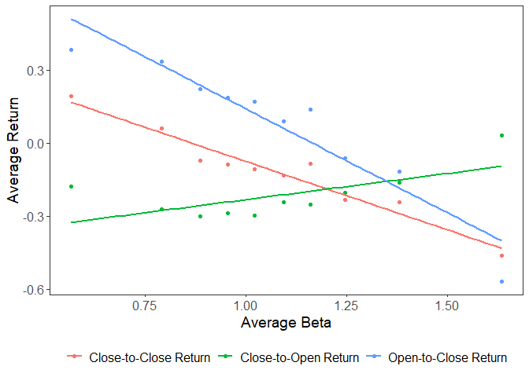
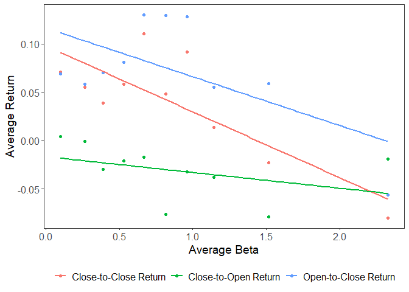
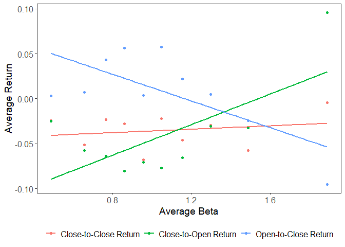

## Analysis of Hendershott, Livdan and Rösch (2020) during Recessionary Periods

### Install Packages & Load Data


``` r
library('tidyverse')

covid <- read_csv('covidprices.csv')
dotcom <- read_csv('dotcomprices.csv')
gfc08 <- read_csv('08prices.csv')
```

### Functions


``` r
BetaSorting <- function(df) {
  
  df01 <- df %>% 
    mutate(Date = as.Date(Date),
           Month = format(Date, "%Y-%m")
    ) %>%
    group_by(Ticker, Month) %>%
    mutate(
      AvgMonthlyBeta = mean(Beta) # Get Average Monthly Betas for each stock
    ) %>%
    ungroup() %>%
    group_by(Month) %>%
    mutate(Decile = ntile(desc(AvgMonthlyBeta), 10)) %>%  # Sort into deciles based on monthly average betas
    select(Date, Month, Ticker, Open, Close, Volume, PreviousDate, CloseLength, ClosetoCloseReturn, OpentoCloseReturn,
           ClosetoOpenReturn, NightReturn, SP500Return, Beta, AvgMonthlyBeta, Decile)  # Re-Order columns
  
  
  return(df01)
  
}
```


``` r
Averaging <- function(df) {
  
  df02 <- df %>%
    group_by(Decile) %>%  # Get average statistics for each decile each month
    summarise(
      AvgCCReturn = mean(ClosetoCloseReturn, na.rm = TRUE),
      AvgOCReturn = mean(OpentoCloseReturn, na.rm = TRUE),
      AvgCOReturn = mean(ClosetoOpenReturn, na.rm = TRUE),
      AvgBeta = mean(AvgMonthlyBeta)
    )
  
  return(df02)
}
```


``` r
Plotting <- function(df) {
  df %>%
    gather('Variable', 'Value', -Decile, -AvgBeta) %>%
    mutate(
      Variable = ifelse(Variable == 'AvgCCReturn', 'Close-to-Close Return',
                        ifelse(Variable == 'AvgCOReturn', 'Close-to-Open Return', 'Open-to-Close Return'))
    ) %>%
    ggplot(aes(x = AvgBeta, y = Value, color = Variable)) +
    geom_point() +
    stat_smooth(method = 'lm', se = FALSE) +
    labs(x = 'Average Beta', y = 'Average Return') +
    theme_bw() + 
    theme(
      legend.title = element_blank() , legend.position = 'bottom', 
      panel.grid.major = element_blank(), panel.grid.minor = element_blank(),
      axis.title = element_text(size = 14), legend.text = element_text(size = 12),
      axis.text = element_text(size = 12)
    )
}
```


``` r
Regression <- function(df) {
  
  regCC <- lm('AvgCCReturn ~ AvgBeta', data = df)
  regOC <- lm('AvgOCReturn ~ AvgBeta', data = df)
  regCO <- lm('AvgCOReturn ~ AvgBeta', data = df)
  
  regCC_summary <- summary(regCC)
  regOC_summary <- summary(regOC)
  regCO_summary <- summary(regCO)
  
  
  results <- tibble(
    Model = c("Close-to-Close Return", "Open-to-Close Return", "Close-to-Open Return"),
    Intercept_Coefficient = c(
      coef(regCC)[1],
      coef(regOC)[1],
      coef(regCO)[1]
    ),
    Intercept_P_Value = c(
      coef(summary(regCC))["(Intercept)", "Pr(>|t|)"],
      coef(summary(regOC))["(Intercept)", "Pr(>|t|)"],
      coef(summary(regCO))["(Intercept)", "Pr(>|t|)"]
    ),
    Slope_Coefficient = c(
      coef(regCC)[2],
      coef(regOC)[2],
      coef(regCO)[2]
    ),
    Slope_P_Value = c(
      coef(summary(regCC))["AvgBeta", "Pr(>|t|)"],
      coef(summary(regOC))["AvgBeta", "Pr(>|t|)"],
      coef(summary(regCO))["AvgBeta", "Pr(>|t|)"]
    ),
    R_Squared = c(
      regCC_summary$r.squared,
      regOC_summary$r.squared,
      regCO_summary$r.squared
    )
  )
  
  knitr::kable(results, format = 'markdown', align = 'lcccc', col.names = gsub("[_]", " ", colnames(results)))
}
```

### Recessionary Period 1: Covid Pandemic


``` r
covid <- covid %>% filter(Date <= '2020-04-30')

covid01 <- BetaSorting(covid)
covid02 <- Averaging(covid01)
Plotting(covid02)
```

```
## `geom_smooth()` using formula = 'y ~ x'
```

<!-- -->

``` r
Regression(covid02)
```


|Model                 | Intercept Coefficient | Intercept P Value | Slope Coefficient | Slope P Value |R Squared |
|:---------------------|:---------------------:|:-----------------:|:-----------------:|:-------------:|:---------|
|Close-to-Close Return |       0.4856616       |     0.0000201     |    -0.5607722     |   0.0000031   |0.9422752 |
|Open-to-Close Return  |       0.9933044       |     0.0000244     |    -0.8522996     |   0.0000343   |0.8952886 |
|Close-to-Open Return  |      -0.4461215       |     0.0017708     |     0.2142944     |   0.0397414   |0.4293017 |

### Recessionary Period 2: Dotcom Bubble


``` r
dotcom01 <- BetaSorting(dotcom)
dotcom02 <- Averaging(dotcom01)
Plotting(dotcom02)
```

```
## `geom_smooth()` using formula = 'y ~ x'
```

<!-- -->

``` r
Regression(dotcom02)
```


|Model                 | Intercept Coefficient | Intercept P Value | Slope Coefficient | Slope P Value |R Squared |
|:---------------------|:---------------------:|:-----------------:|:-----------------:|:-------------:|:---------|
|Close-to-Close Return |       0.0979227       |     0.0008144     |    -0.0681278     |   0.0045557   |0.6551212 |
|Open-to-Close Return  |       0.1165687       |     0.0015054     |    -0.0504533     |   0.0592592   |0.3763325 |
|Close-to-Open Return  |      -0.0165780       |     0.2891903     |    -0.0163281     |   0.2634337   |0.1531500 |

### Recessionary Period 3: '08 Global Financial Crisis


``` r
gfc0801 <- BetaSorting(gfc08)
gfc0802 <- Averaging(gfc0801)
Plotting(gfc0802)
```

```
## `geom_smooth()` using formula = 'y ~ x'
```

<!-- -->

``` r
Regression(gfc0802)
```


|Model                 | Intercept Coefficient | Intercept P Value | Slope Coefficient | Slope P Value |R Squared |
|:---------------------|:---------------------:|:-----------------:|:-----------------:|:-------------:|:---------|
|Close-to-Close Return |      -0.0454629       |     0.0377504     |     0.0095019     |   0.5724889   |0.0414833 |
|Open-to-Close Return  |       0.0866347       |     0.0231720     |    -0.0742430     |   0.0263325   |0.4800872 |
|Close-to-Open Return  |      -0.1308399       |     0.0071751     |     0.0850428     |   0.0299001   |0.4648223 |
